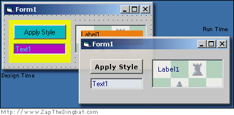

<div align="center">

## Style your apps controls


</div>

### Description

Style Sheet your apps

OK, OK it's not exactly CSS. However, if you want to have orange frames and purple buttons at design time so you can see where those anoying borderless frames or flat picture boxes are, and then set it all to look pretty again at run time, without spending your life setting "back color" values and "font size" properties then this is a simple piece of code that might help.
 
### More Info
 


<span>             |<span>
---                |---
**Submitted On**   |
**By**             |[Zap The Dingbat](https://github.com/Planet-Source-Code/PSCIndex/blob/master/ByAuthor/zap-the-dingbat.md)
**Level**          |Beginner
**User Rating**    |4.8 (19 globes from 4 users)
**Compatibility**  |VB 4\.0 \(32\-bit\), VB 5\.0, VB 6\.0, VBA MS Access, VBA MS Excel
**Category**       |[Custom Controls/ Forms/  Menus](https://github.com/Planet-Source-Code/PSCIndex/blob/master/ByCategory/custom-controls-forms-menus__1-4.md)
**World**          |[Visual Basic](https://github.com/Planet-Source-Code/PSCIndex/blob/master/ByWorld/visual-basic.md)
**Archive File**   |[](https://github.com/Planet-Source-Code/zap-the-dingbat-style-your-apps-controls__1-39052/archive/master.zip)


### Source Code

```
'Style Sheets for your apps
 'OK, OK it's not exactly CSS. However, if you want to have orange
 'frames and purple buttons at design time so you can see where
 'those anoying borderless frames or flat picture boxes are, and
 'then set it all to look pretty again at run time, without
 'spending your life setting "back color" values and "font size"
 'properties then this is a simple piece of code that might help.
 'in theory it would be possible to make it read an external CSS style settings file
 'but i just can't be arsed!
 'I'm sure some clever person out there will give it a go
Private Sub Form_Load()
 applyStyle
End Sub
Sub applyStyle()
 Me.Show
 Dim tmpControl As Control
 'Loop through each control on your form using the "Controls" collection
 For Each tmpControl In Me.Controls
  'determine the type of control using the "TypeOf, Is" syntax
  If TypeOf tmpControl Is TextBox Then
   'then set the appropriate properties to create your desired look
   'you could even call functions to manipulate the controls or even APIs using the
   'tmpControl.hWnd property to reference their windowHandle
   tmpControl.ForeColor = RGB(0, 0, 128)
   tmpControl.BackColor = RGB(240, 240, 240)
  ElseIf TypeOf tmpControl Is CommandButton Then
   tmpControl.FontName = "Verdana"
   tmpControl.FontBold = True
   tmpControl.BackColor = vbButtonFace
  ElseIf TypeOf tmpControl Is Frame Then
   tmpControl.FontName = "Verdana"
   tmpControl.FontSize = 10
   tmpControl.ForeColor = RGB(0, 0, 128)
   tmpControl.BackColor = vbButtonFace
   tmpControl.Appearance = 1
  ElseIf TypeOf tmpControl Is Label Then
   tmpControl.FontName = "Verdana"
   tmpControl.ForeColor = RGB(0, 0, 128)
   tmpControl.BackColor = vbButtonFace
   tmpControl.BackStyle = 0
  ElseIf TypeOf tmpControl Is PictureBox Then
  ElseIf TypeOf tmpControl Is Menu Then
   'it might be worth leaving some of the "if"s blank just to acknowledge the control's existence for later use
  Else
   'and this little snippit is invaluable when working out the exact name of the control type
   'but I suggest that you REM it out when you compile, to avoid confused users
   MsgBox "Control Type: " & TypeName(tmpControl) & vbNewLine & "Control Name: " & tmpControl.Name
  End If
 Next
End Sub
 'any comments would be appreciated.
 'thanks. Zap The Dingbat
```

